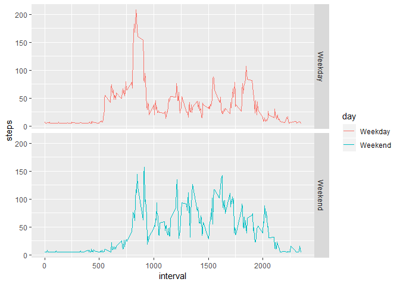

## Loading and preprocessing the data
1. Unzip the activity file
2. Read the activity file using read.csv
3. Convert date column from factor into date

```r
library(ggplot2)
unzip("activity.zip")
activity <- read.csv("activity.csv", header = TRUE, na.strings = "NA")
activity$date <- as.Date(activity$date, format = "%Y-%m-%d")
```

## What is mean total number of steps taken per day?
1. Use aggregate to sum steps per date
2. Plot histogram of steps (for each date) using ggplot
3. Calculate mean of steps per date
4. Calculate median of steps per date

```r
steps_vs_date <- aggregate(steps ~ date, data = activity, sum)
ggplot(data = steps_vs_date, aes(steps))+geom_histogram(binwidth = 1000)
```

<!-- -->

```r
print(paste0("The mean of total numbers of steps taken per day is ", mean(steps_vs_date$steps)))
```

```
## [1] "The mean of total numbers of steps taken per day is 10766.1886792453"
```

```r
print(paste0("The median of total numbers of steps taken per day is ", median(steps_vs_date$steps)))
```

```
## [1] "The median of total numbers of steps taken per day is 10765"
```

## What is the average daily activity pattern?
1. Use aggregate to steps per interval
2. Plot steps vs interval using ggplot
3. Use which max to identify the 5-minute interval period containing the max number of steps. 

```r
steps_vs_interval <- aggregate(steps ~ interval, data = activity, mean)
ggplot(data = steps_vs_interval, aes(x = interval, y = steps))+geom_line()
```

<!-- -->

```r
print(paste0("The 5-minute interval that contains the maximum number of steps on average is: ",
             steps_vs_interval$interval[which.max(steps_vs_interval$steps)], " 5-minute interval"))
```

```
## [1] "The 5-minute interval that contains the maximum number of steps on average is: 835 5-minute interval"
```


## Imputing missing values
1. The only missing values are in steps. 
2. Impute the missing steps value as the average step for the entire dataset
3. New data set is called activity_impute
4. Imputing the way devised above makes median = mean

```r
sapply(activity, function(x) (sum(is.na(x))))
```

```
##    steps     date interval 
##     2304        0        0
```

```r
print(paste0("Total number of missing values is ", sum(is.na(activity))))
```

```
## [1] "Total number of missing values is 2304"
```

```r
activity_impute <- activity
activity_impute$steps[is.na(activity_impute$steps)] <- mean(activity_impute$steps, na.rm = TRUE)
steps_vs_date_impute <- aggregate(steps ~ date, data = activity_impute, sum)
ggplot(data = steps_vs_date_impute, aes(steps))+geom_histogram(binwidth = 1000)
```

<!-- -->

```r
print(paste0("The mean of total numbers of steps taken per day is ", mean(steps_vs_date_impute$steps)))
```

```
## [1] "The mean of total numbers of steps taken per day is 10766.1886792453"
```

```r
print(paste0("The median of total numbers of steps taken per day is ", median(steps_vs_date_impute$steps)))
```

```
## [1] "The median of total numbers of steps taken per day is 10766.1886792453"
```

## Are there differences in activity patterns between weekdays and weekends?
1. Use weekday function to get day of the week. If it's Saturday or Sunday, label it as weekend. Else as weekday. 
2. Aggregate to get mean of setps per 5 minute period and the day.
3. Plot as line plot using ggplot

```r
activity_impute$day <- ifelse(weekdays(activity_impute$date) %in% c("Saturday", "Sunday"), "Weekend", "Weekday")
steps_vs_interval_impute <- aggregate(steps ~ interval + day, data = activity_impute, mean)
ggplot(data = steps_vs_interval_impute, aes(x = interval, y = steps, color = day))+geom_line()+facet_grid(day ~ .)
```

<!-- -->
